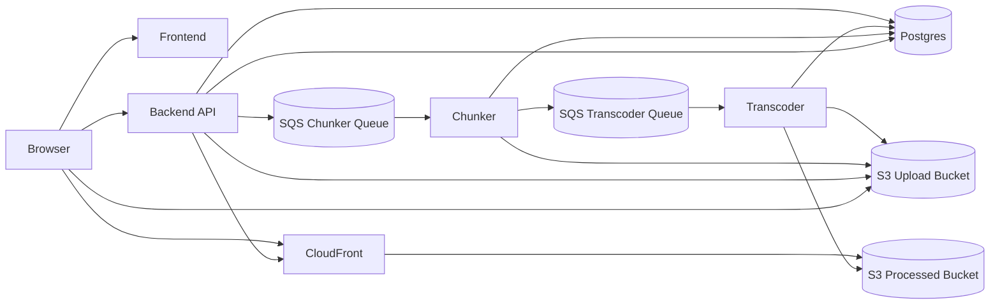
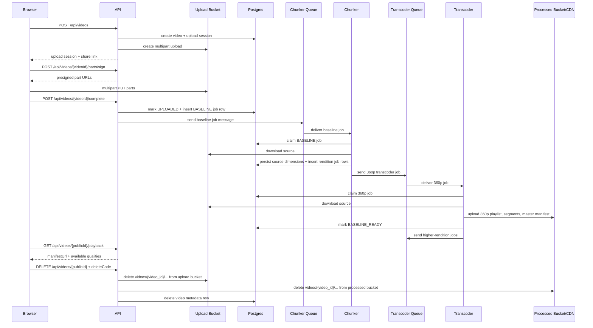

# Architecture

VidArchi separates request handling from media processing so uploads stay lightweight while video packaging scales independently.

Refer to:
- [SYSTEM_DESIGN_PROJECT_REQUIREMENTS_GUIDELINES.md](/Users/dave/LabBase/vid-archi/references/SYSTEM_DESIGN_PROJECT_REQUIREMENTS_GUIDELINES.md)
- [youtube_system_design_reference.md](/Users/dave/LabBase/vid-archi/references/youtube_system_design_reference.md)
- [Youtube-problem-writeup.md](/Users/dave/LabBase/vid-archi/references/Youtube-problem-writeup.md)

## Component Diagram



## Upload To First Play



## Runtime Responsibilities

- `backend`
  - owns upload session lifecycle, delete-code hashing/verification, public video lookup, and playback metadata
  - never proxies video bytes
  - enqueues baseline processing messages onto the chunker SQS queue after upload completion
- `chunker`
  - consumes the chunker SQS queue
  - claims parent baseline jobs in Postgres for idempotency
  - probes the source file with `ffprobe`
  - creates the baseline transcode job and any eligible higher renditions in Postgres
  - publishes the baseline transcode message to the transcoder SQS queue
- `transcoder`
  - consumes the transcoder SQS queue
  - runs one configured rendition per process
  - packages HLS artifacts with `ffmpeg`
  - refreshes `master.m3u8` as renditions finish
  - updates Postgres as the durable source of truth for playback readiness

## Scaling And Consistency

- Uploads scale with object storage rather than API CPU or memory.
- API nodes remain stateless because streamability is derived from Postgres, not local memory.
- Chunkers scale on chunker-queue depth.
- Transcoders scale on transcoder-queue depth.
- Standard SQS delivery is tolerated because Postgres still gates all job claims and status transitions, so duplicate queue deliveries only produce stale messages, not duplicate completed work.
- `BASELINE_READY` is the first playback milestone. Higher renditions continue in the background under `PROCESSING_FULL`.

## Anonymous Delete Flow

- The upload form requires a delete code as an anonymous ownership substitute.
- Postgres stores only a salted hash of that code; the plaintext never becomes long-lived application state.
- `DELETE /api/videos/{publicId}` verifies the submitted code, deletes the upload-bucket prefix, deletes the processed-bucket prefix, and then removes the `videos` row so related metadata cascades.
- The deterministic `videos/{video_id}/...` key layout keeps deletion bounded to a single prefix in each bucket instead of runtime object discovery by ad hoc naming.

## Structured Logging

- All Rust services emit JSON logs through `tracing`.
- The API accepts or generates `x-correlation-id` and echoes it in every response.
- `processing_jobs` and `transcoding_jobs` persist `correlation_id`, so chunker and transcoder spans carry the same identifier as the API request that queued the baseline pipeline.
- Default log level is `INFO`. Set `RUST_LOG=debug` on any service for deeper traces.

## STG Topology

Current staging layout:

- App host
  - backend API
  - frontend
  - Postgres container
- Chunker host
  - `chunker` container replicas
- Transcoder host
  - one container definition per rendition
- Shared AWS services
  - ALB: `stg-api-alb`
  - CloudFront: `d38ixt0cyn1hi6.cloudfront.net`
  - Upload bucket: `stg-video-upload-1a`
  - Processed bucket: `stg-video-processed-1a`
  - Chunker queue: `stg-chunker-queue`
  - Transcoder queues: `stg-transcoder-{360p,480p,720p,1080p,1440p,2160p}-queue`

## Ingress Decision

API Gateway is intentionally omitted from the current staging path. The active ingress path is:

```text
Client -> ALB -> backend API
```

That keeps the environment smaller and cheaper while the service shape is still evolving. The upgrade path is straightforward:

```text
Client -> API Gateway -> ALB -> backend API
```

API Gateway becomes useful when the service needs centralized auth, throttling, request validation, or a stricter public API management layer.
