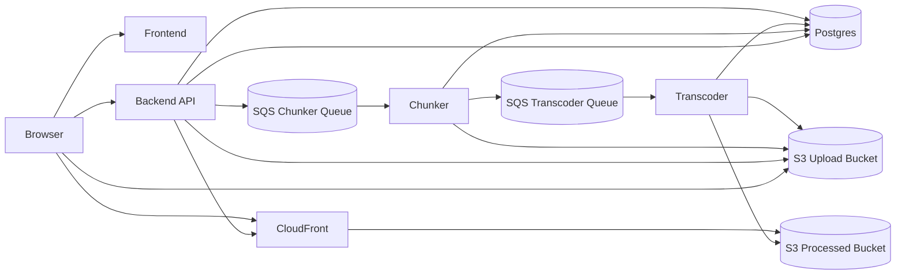
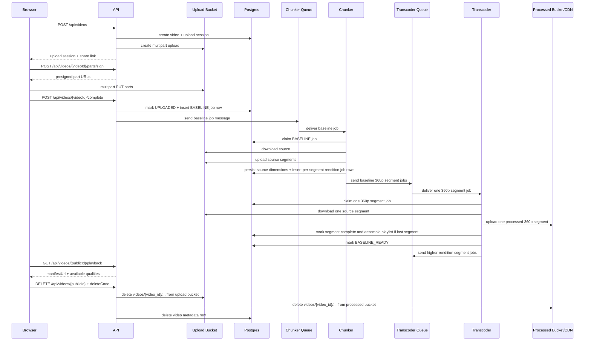

# Architecture

VidArchi separates request handling from media processing so uploads stay lightweight while video packaging scales independently.

## Component Diagram



## Upload To First Play



## Main Path Explained

### 1. Upload setup

The browser begins by calling `POST /api/videos`. The backend creates a `videos` record for the asset, creates an `upload_sessions` record for the active multipart upload attempt, initializes the multipart upload in the upload bucket, and returns the identifiers and endpoints the browser needs to continue.

At this stage the API is only setting up the transfer. It is not receiving or storing the full video bytes itself.

### 2. Browser uploads directly to object storage

The browser requests signed part URLs from `POST /api/videos/{videoId}/parts/sign` and uploads each part directly to S3. This keeps large file transfers off the backend and allows the upload path to scale with object storage instead of application server bandwidth.

As soon as the upload is actively being used, the video moves from `INITIATED` to `UPLOADING`.

### 3. Upload completion creates processing work

When the browser calls `POST /api/videos/{videoId}/complete`, the backend completes the multipart upload in S3, marks the upload session as `COMPLETED`, moves the video to `UPLOADED`, inserts a `BASELINE` job into `processing_jobs`, and publishes a matching message to the chunker queue.

This is the handoff point between the request path and the background processing path.

### 4. Chunker prepares the source for playback

The chunker receives the queue message and claims the matching job in Postgres before doing work. That claim step is what makes duplicate queue deliveries safe: if the job has already been claimed or finished, the extra message becomes harmless.

Once claimed, the chunker downloads the source object from the upload bucket, probes it with `ffprobe`, stores the source dimensions on the video record, splits the original file into reusable source segments, uploads those segments back into object storage, and creates one transcoding job per segment for the baseline rendition plus any higher renditions that are valid for the source resolution. It publishes only the baseline `360p` segment jobs first so the system reaches first playback as quickly as possible.

During this phase the video is in `PROCESSING_BASELINE`.

### 5. Transcoder produces the first playable rendition

The transcoder receives baseline segment jobs, claims the corresponding `transcoding_jobs` row in Postgres, downloads only the claimed source segment, and runs `ffmpeg` to produce the processed segment for its configured rendition. Segment jobs can finish out of order.

After a segment upload succeeds, the transcoder opens a locked completion transaction for that video in Postgres and asks for the latest job state for every segment in that rendition. If any segment is still `QUEUED`, `RUNNING`, or has only failed attempts so far, the rendition is not complete yet and the worker stops there. If every segment's latest state is `SUCCEEDED`, that worker assembles the final variant playlist in segment order, refreshes `master.m3u8`, and marks the rendition ready. That is how the system avoids race conditions when multiple segment workers finish close together.

When the full baseline rendition has been assembled, the transcoder marks the `360p` row in `video_renditions` as ready and updates the `videos` row to `BASELINE_READY`. At that point `is_streamable` becomes true and the `manifest_s3_key` is available for playback responses.

This is the first moment the video is considered streamable.

### 6. Playback and background quality upgrades

Once the video reaches `BASELINE_READY`, `GET /api/videos/{publicId}/playback` can return the manifest URL and the browser can start playback through CloudFront. The player can begin with the baseline stream while higher renditions are still being processed.

After baseline playback is available, the transcoder releases the queued higher-rendition jobs. Those continue in the background, move the video through `PROCESSING_FULL`, and add more entries to `video_renditions` as each quality finishes. When all intended renditions are done, the video can move to `READY`, and the intermediate source-segment objects are deleted from the upload bucket. The original uploaded source file is kept.

## Runtime Responsibilities

- `backend`
  - owns upload session lifecycle, delete-code hashing/verification, public video lookup, and playback metadata
  - never proxies video bytes
  - enqueues baseline processing messages onto the chunker SQS queue after upload completion
- `chunker`
  - consumes the chunker SQS queue
  - claims parent baseline jobs in Postgres for idempotency
  - probes the source file with `ffprobe`
  - splits the source into reusable upload-bucket segments
  - creates per-segment baseline and higher-rendition jobs in Postgres
  - publishes the baseline segment jobs to the transcoder SQS queues
- `transcoder`
  - consumes the transcoder SQS queue
  - runs one configured rendition per process
  - transcodes one source segment at a time with `ffmpeg`
  - assembles the final rendition playlist after the last segment for that rendition finishes
  - refreshes `master.m3u8` as renditions become ready
  - deletes the intermediate source-segment prefix after the video reaches `READY`
  - updates Postgres as the durable source of truth for playback readiness

## Scaling And Consistency

- Uploads scale with object storage rather than API CPU or memory.
- API nodes remain stateless because streamability is derived from Postgres, not local memory.
- Chunkers scale on chunker-queue depth.
- Transcoders scale on transcoder-queue depth.
- Standard SQS delivery is tolerated because Postgres still gates all job claims and status transitions, so duplicate queue deliveries only produce stale messages, not duplicate completed work.
- Rendition completion is decided under a locked Postgres transaction by checking the latest state of every segment for that rendition, so out-of-order segment finishes do not corrupt playlist assembly.
- `BASELINE_READY` is the first playback milestone. Higher renditions continue in the background under `PROCESSING_FULL`.

## Anonymous Delete Flow

- The upload form requires a delete code as an anonymous ownership substitute.
- Postgres stores only a salted hash of that code; the plaintext never becomes long-lived application state.
- `DELETE /api/videos/{publicId}` verifies the submitted code, deletes the upload-bucket prefix, deletes the processed-bucket prefix, and then removes the `videos` row so related metadata cascades.
- The deterministic `videos/{video_id}/...` key layout keeps deletion bounded to a single prefix in each bucket instead of runtime object discovery by ad hoc naming.

## Structured Logging

- All Rust services emit JSON logs through `tracing`.
- The API accepts or generates `x-correlation-id` and echoes it in every response.
- `processing_jobs` and `transcoding_jobs` persist `correlation_id`, so chunker and transcoder spans carry the same identifier as the API request that queued the baseline pipeline.
- Default log level is `INFO`. Set `RUST_LOG=debug` on any service for deeper traces.

## STG Topology

Current staging layout:

- App host
  - backend API
  - frontend
  - Postgres container
- Chunker host
  - `chunker` container replicas
- Transcoder host
  - one container definition per rendition
- Shared AWS services
  - ALB: `stg-api-alb`
  - CloudFront: `d38ixt0cyn1hi6.cloudfront.net`
  - Upload bucket: `stg-video-upload-1a`
  - Processed bucket: `stg-video-processed-1a`
  - Chunker queue: `stg-chunker-queue`
  - Transcoder queues: `stg-transcoder-{360p,480p,720p,1080p,1440p,2160p}-queue`

## Ingress Decision

API Gateway is intentionally omitted from the current staging path. The active ingress path is:

```text
Client -> ALB -> backend API
```

That keeps the environment smaller and cheaper while the service shape is still evolving. The upgrade path is straightforward:

```text
Client -> API Gateway -> ALB -> backend API
```

API Gateway becomes useful when the service needs centralized auth, throttling, request validation, or a stricter public API management layer.
