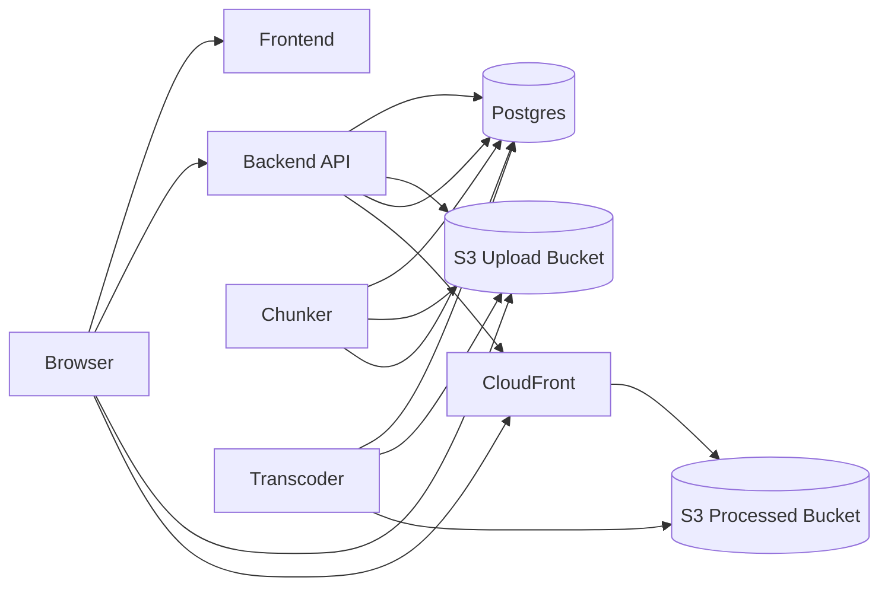
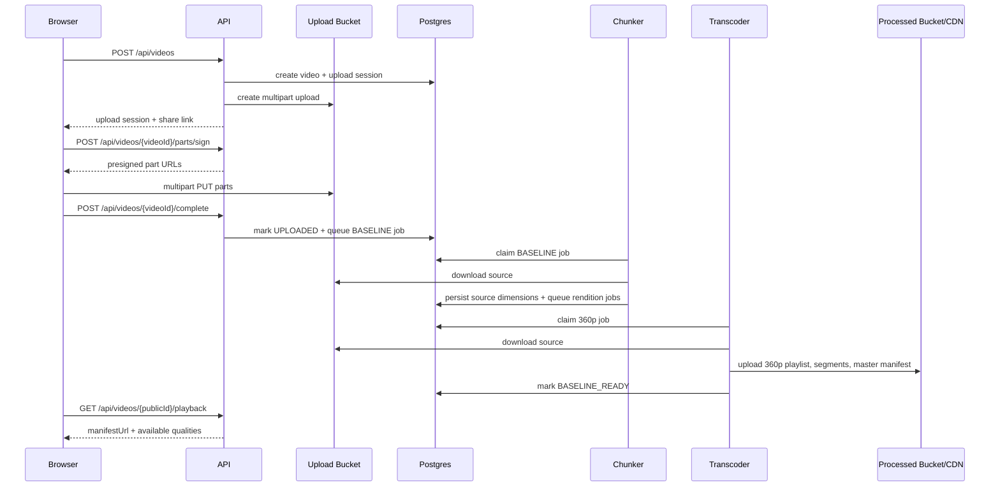

# Architecture

VidArchi separates request handling from media processing so uploads stay lightweight while video packaging scales independently.

## Component Diagram



## Upload To First Play



## Runtime Responsibilities

- `backend`
  - owns upload session lifecycle, public video lookup, and playback metadata
  - never proxies video bytes
- `chunker`
  - claims parent baseline jobs
  - probes the source file with `ffprobe`
  - creates the baseline transcode job and any eligible higher renditions
- `transcoder`
  - runs one configured rendition per process
  - packages HLS artifacts with `ffmpeg`
  - refreshes `master.m3u8` as renditions finish

## Scaling And Consistency

- Uploads scale with object storage rather than API CPU or memory.
- API nodes remain stateless because streamability is derived from Postgres, not local memory.
- Chunkers scale on queued baseline jobs.
- Transcoders scale by rendition, which allows heavier qualities such as `1080p` or `2160p` to receive more capacity without affecting baseline throughput.
- `BASELINE_READY` is the first playback milestone. Higher renditions continue in the background under `PROCESSING_FULL`.

## Structured Logging

- All Rust services emit JSON logs through `tracing`.
- The API accepts or generates `x-correlation-id` and echoes it in every response.
- `processing_jobs` and `transcoding_jobs` persist `correlation_id`, so chunker and transcoder spans carry the same identifier as the API request that queued the baseline pipeline.
- Default log level is `INFO`. Set `RUST_LOG=debug` on any service for deeper traces.

## STG Topology

Current staging layout:

- App host
  - backend API
  - frontend
  - Postgres container
- Chunker host
  - `chunker` container replicas
- Transcoder host
  - one container definition per rendition
- Shared AWS services
  - ALB: `stg-api-alb`
  - CloudFront: `d38ixt0cyn1hi6.cloudfront.net`
  - Upload bucket: `stg-video-upload-1a`
  - Processed bucket: `stg-video-processed-1a`
  - Chunker queue: `stg-chunker-queue`
  - Transcoder queue: `stg-transcoder-queue`

## Ingress Decision

API Gateway is intentionally omitted from the current staging path. The active ingress path is:

```text
Client -> ALB -> backend API
```

That keeps the environment smaller and cheaper while the service shape is still evolving. The upgrade path is straightforward:

```text
Client -> API Gateway -> ALB -> backend API
```

API Gateway becomes useful when the service needs centralized auth, throttling, request validation, or a stricter public API management layer.
