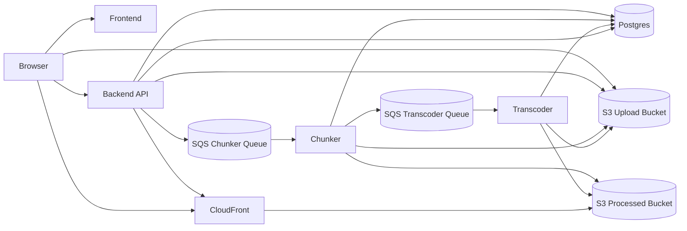
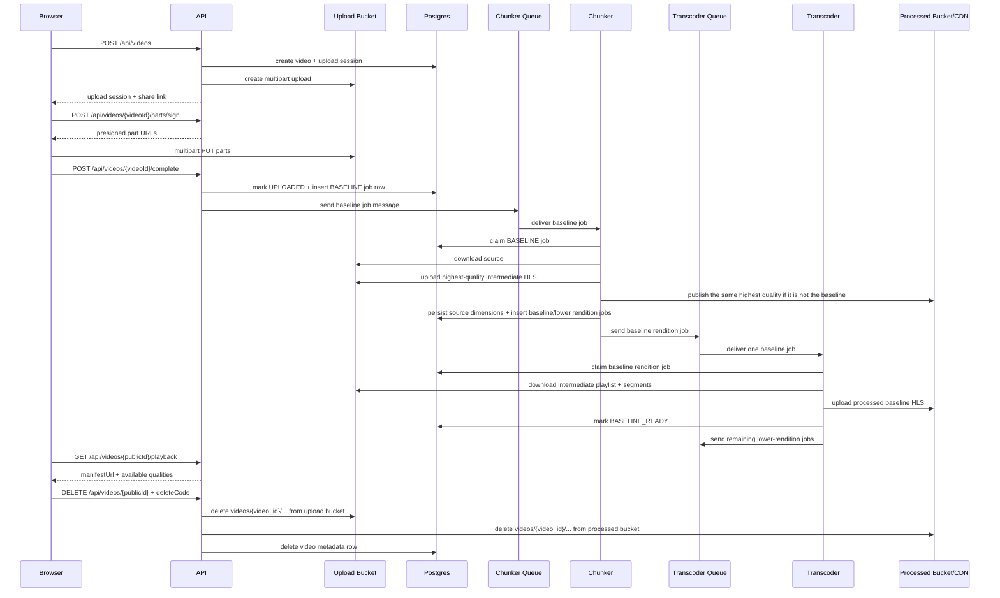

# Architecture

VidArchi separates request handling from media processing so uploads stay lightweight while video packaging scales independently.

## Component Diagram



## Upload To First Play



## Main Path Explained

### 1. Upload setup

The browser begins by calling `POST /api/videos`. The backend creates a `videos` record for the asset, creates an `upload_sessions` record for the active multipart upload attempt, initializes the multipart upload in the upload bucket, and returns the identifiers and endpoints the browser needs to continue.

At this stage the API is only setting up the transfer. It is not receiving or storing the full video bytes itself.

### 2. Browser uploads directly to object storage

The browser requests signed part URLs from `POST /api/videos/{videoId}/parts/sign` and uploads each part directly to S3. This keeps large file transfers off the backend and allows the upload path to scale with object storage instead of application server bandwidth.

As soon as the upload is actively being used, the video moves from `INITIATED` to `UPLOADING`.

### 3. Upload completion creates processing work

When the browser calls `POST /api/videos/{videoId}/complete`, the backend completes the multipart upload in S3, marks the upload session as `COMPLETED`, moves the video to `UPLOADED`, inserts a `BASELINE` job into `processing_jobs`, and publishes a matching message to the chunker queue.

This is the handoff point between the request path and the background processing path.

### 4. Chunker prepares the intermediate source

The chunker receives the queue message and claims the matching baseline job in Postgres before doing work. Once claimed, it downloads the uploaded source file, probes the real dimensions, and generates one continuous HLS rendition at the highest quality the source can support.

That highest-quality HLS output serves two purposes. First, it becomes the intermediate source stored in the upload bucket for the lower transcoders to reuse. Second, if that quality is above the baseline rendition, the chunker also seeds it into the processed bucket so the system does not waste time transcoding the top quality twice.

During the same transaction window, the chunker stores the source dimensions on the `videos` row and creates the `transcoding_jobs` rows the lower workers will use next.

### 5. Transcoder produces the first playable rendition

The baseline transcoder claims the `360p` job, downloads the intermediate playlist and segments from the upload bucket, and runs `ffmpeg` against that intermediate HLS input to produce the final baseline HLS output in the processed bucket.

After the baseline rendition is uploaded, the transcoder updates `video_renditions`, refreshes `master.m3u8`, and moves the video to `BASELINE_READY`. That is the first point where the API can mark the video as streamable and return playback URLs.

### 6. Playback and background quality upgrades

Once the video reaches `BASELINE_READY`, `GET /api/videos/{publicId}/playback` returns the manifest URL and the browser starts playback through CloudFront. The player can begin at the baseline quality immediately.

After that handoff, the remaining lower-quality transcoders consume the same intermediate playlist from the upload bucket and publish their final renditions to the processed bucket. When all planned qualities are ready, the video moves to `READY` and the temporary intermediate HLS objects are deleted from the upload bucket. The original uploaded source file is kept.

## Runtime Responsibilities

- `backend`
  - owns upload session lifecycle, delete-code hashing/verification, public video lookup, and playback metadata
  - never proxies video bytes
  - enqueues baseline processing messages onto the chunker SQS queue after upload completion
- `chunker`
  - consumes the chunker SQS queue
  - claims parent baseline jobs in Postgres for idempotency
  - probes the source file with `ffprobe`
  - builds one highest-eligible intermediate HLS rendition from the uploaded source
  - stores that intermediate rendition in the upload bucket
  - publishes the same top quality directly to the processed bucket when it avoids redundant work
  - creates the baseline and lower-rendition transcoding jobs in Postgres
  - publishes the baseline job to the transcoder SQS queues
- `transcoder`
  - consumes the transcoder SQS queue
  - runs one configured rendition per process
  - downloads the intermediate HLS input from the upload bucket
  - transcodes one full rendition from that intermediate input with `ffmpeg`
  - refreshes `master.m3u8` as renditions become ready
  - deletes the intermediate source prefix after the video reaches `READY`
  - updates Postgres as the durable source of truth for playback readiness

## Scaling And Consistency

- Uploads scale with object storage rather than API CPU or memory.
- API nodes remain stateless because streamability is derived from Postgres, not local memory.
- Chunkers scale on chunker-queue depth.
- Transcoders scale on transcoder-queue depth.
- Standard SQS delivery is tolerated because Postgres still gates all job claims and status transitions, so duplicate queue deliveries only produce stale messages, not duplicate completed work.
- The intermediate HLS stage keeps lower transcoders from repeatedly downloading the original upload and avoids rebuilding the top quality twice.
- `BASELINE_READY` is the first playback milestone. Higher renditions continue in the background under `PROCESSING_FULL`.

## Anonymous Delete Flow

- The upload form requires a delete code as an anonymous ownership substitute.
- Postgres stores only a salted hash of that code; the plaintext never becomes long-lived application state.
- `DELETE /api/videos/{publicId}` verifies the submitted code, deletes the upload-bucket prefix, deletes the processed-bucket prefix, and then removes the `videos` row so related metadata cascades.
- The deterministic `videos/{video_id}/...` key layout keeps deletion bounded to a single prefix in each bucket instead of runtime object discovery by ad hoc naming.

## Structured Logging

- All Rust services emit JSON logs through `tracing`.
- The API accepts or generates `x-correlation-id` and echoes it in every response.
- `processing_jobs` and `transcoding_jobs` persist `correlation_id`, so chunker and transcoder spans carry the same identifier as the API request that queued the baseline pipeline.
- Default log level is `INFO`. Set `RUST_LOG=debug` on any service for deeper traces.

## STG Topology

Current staging layout:

- App host
  - backend API
  - frontend
  - Postgres container
- Chunker host
  - `chunker` container replicas
- Transcoder host
  - one container definition per rendition
- Shared AWS services
  - ALB: `stg-api-alb`
  - CloudFront: `d38ixt0cyn1hi6.cloudfront.net`
  - Upload bucket: `stg-video-upload-1a`
  - Processed bucket: `stg-video-processed-1a`
  - Chunker queue: `stg-chunker-queue`
  - Transcoder queues: `stg-transcoder-{360p,480p,720p,1080p,1440p,2160p}-queue`

## Ingress Decision

API Gateway is intentionally omitted from the current staging path. The active ingress path is:

```text
Client -> ALB -> backend API
```

That keeps the environment smaller and cheaper while the service shape is still evolving. The upgrade path is straightforward:

```text
Client -> API Gateway -> ALB -> backend API
```

API Gateway becomes useful when the service needs centralized auth, throttling, request validation, or a stricter public API management layer.
